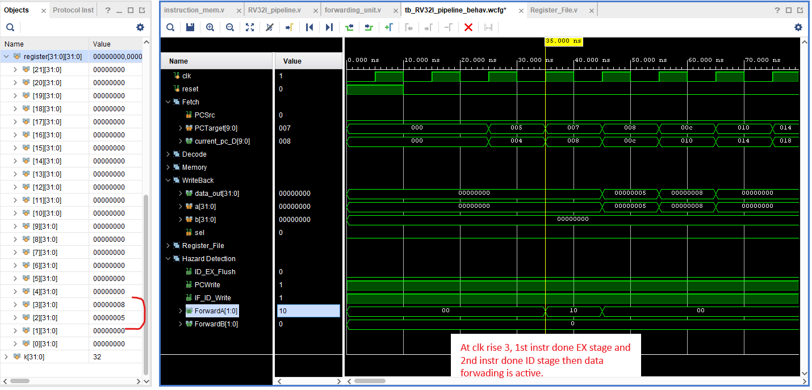

# RISC-V Pipeline

## Overview
This project implements a **5-stage RISC-V pipeline processor** with support for:
- Instruction Fetch (IF)
- Instruction Decode (ID)
- Execute (EX)
- Memory (MEM)
- Write Back (WB)

It includes **hazard detection** and **data forwarding** mechanisms to handle dependencies efficiently.

---
## Module Structure

├── RV32I_pipeline.v
│   ├── IF_ID.v
|        ├── program_counter.v
|        ├── PC_Adder.v
|        ├── instruction_mem.v
│   ├── ID_EX.v  
|        ├── Register_File.v
|        ├── Control_unit.v
|        ├── Imm_Gen.v
│   ├── EX_MEM.v
|        ├── ALU.v
|        ├── mux3X1.v
|        ├── mux2X1.v
│   ├── MEM_WB.v
|        ├── data_mem.v
│   ├── WriteBack(mux2X1.v)
│   ├── forwarding_unit.v
│   ├── hazard_detection_unit.v

## Successful Pipeline Test

The following instructions were used to verify correct pipeline execution:

```assembly
addi x2, x0, 5   # x2 = 5
addi x3, x0, 7   # x3 = 7
addi x4, x0, 8   # x4 = 8
addi x5, x0, 9   # x5 = 9
addi x6, x0, 10  # x6 = 10
```

Result: All instructions executed successfully with correct register updates.

<p align="center">  </p>

## Data Forwarding Test

To verify EX hazard resolution and data forwarding functionality:

```assembly
addi x2, x0, 5   # x2 = 5
addi x3, x2, 3   # x3 = 8  (depends on x2)
```


Result: The forwarding unit successfully eliminated the stall and produced the correct result.

<p align="center">  </p>

