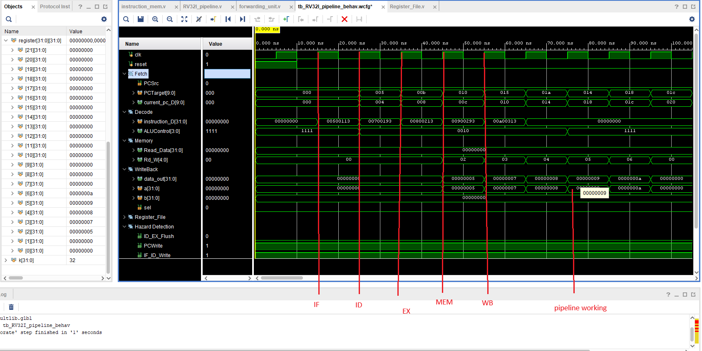

# RISCV_Pipeline

Successfully test the pipeline using the following instruction:
mem[0]  = 8'h13; //addi x2, x0, 5 -> x2 = 5;
mem[1]  = 8'h01;
mem[2]  = 8'h50;
mem[3]  = 8'h00;
                
mem[4]  = 8'h93; // addi x3, x0, 7 -> x3 = 7;
mem[5]  = 8'h01;
mem[6]  = 8'h70;
mem[7]  = 8'h00;

mem[8]  = 8'h13; // addi x4, x0, 8 -> x4 = 8
mem[9]  = 8'h02;
mem[10] = 8'h80;
mem[11] = 8'h00;

mem[12] = 8'h93; // addi x5, x0, 9 -> x5 = 9
mem[13] = 8'h02;
mem[14] = 8'h90;
mem[15] = 8'h00;

mem[16] = 8'h13; // addi x6, x0, 10 -> x6 = 10
mem[17] = 8'h03;
mem[18] = 8'hA0;
mem[19] = 8'h00;

